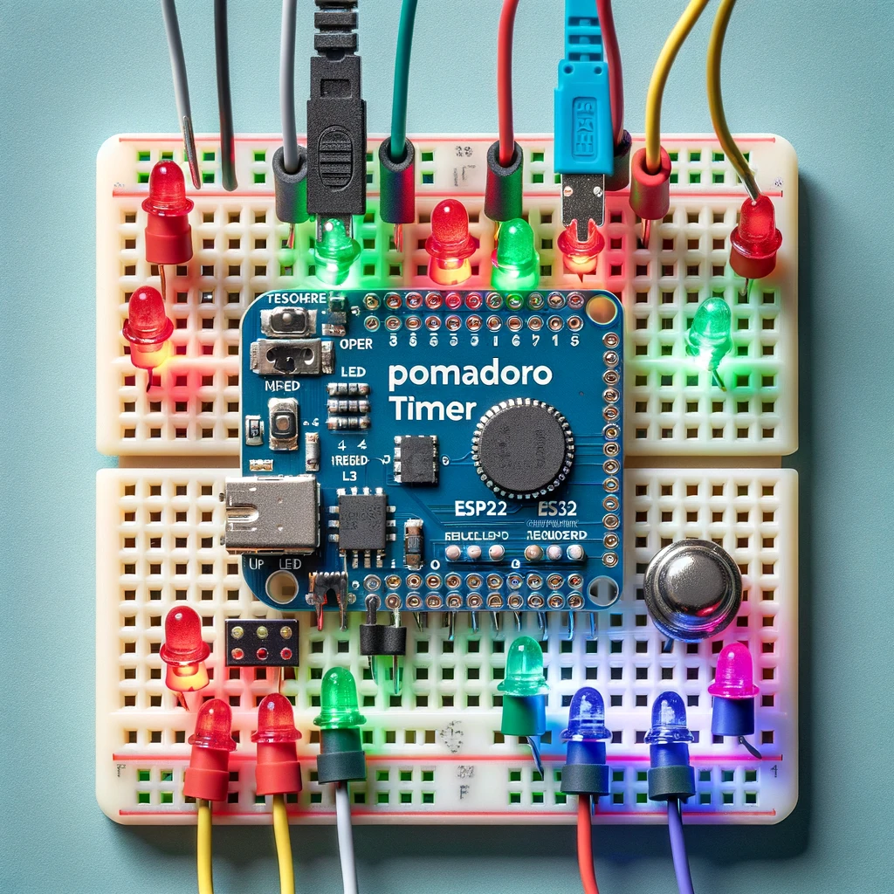

# ESP32 Pomodoro Timer

This project is a Pomodoro Timer implemented using an ESP32 microcontroller, which connects to the Blynk app for remote control and monitoring. The timer features LED indicators and a buzzer for visual and auditory cues.

## Features

- **Study Timer**: Set and manage study sessions.
- **Break Timer**: Manage short and long breaks.
- **LED Indicators**: RGB LEDs to indicate different states.
- **Buzzer Alerts**: Sound alerts for session changes.
- **Blynk Integration**: Remote control and monitoring via Blynk app.

## Components

- ESP32 Microcontroller
- RGB LEDs (3 LEDs for Red, Green, and Blue)
- Buzzer
- Blynk App

## Circuit Diagram

## Project Image

## Blynk style

## Connections

| ESP32 Pin | Component      | Color  |
|-----------|----------------|--------|
| 21        | RGB LED Red    | Red    |
| 5         | RGB LED Green  | Green  |
| 18        | RGB LED Blue   | Blue   |
| 26        | Buzzer         | -      |

## Setup Instructions

### Hardware Setup

- Connect the RGB LEDs and Buzzer to the ESP32 pins as per the connection table.

### Blynk Setup

- Create a new project in the Blynk app.
- Add the following widgets:
  - Button (V0): Start/Restart
  - Button (V1): Stop/Resume
  - Slider (V2): Set study time
  - Slider (V3): Set number of sessions
  - Display (V4): Session and break time
- Use the provided Blynk authentication token in the code.

### Programming the ESP32

- Install the Blynk library in the Arduino IDE.
- Upload the provided code to the ESP32.

### Running the Project

- Connect the ESP32 to power.
- Open the Blynk app and connect to the ESP32.
- Use the buttons and sliders in the Blynk app to control the Pomodoro timer.

## Code

The code for this project can be found in the `pomodoro_timer.ino` file.

### License

This project is licensed under the MIT License.

